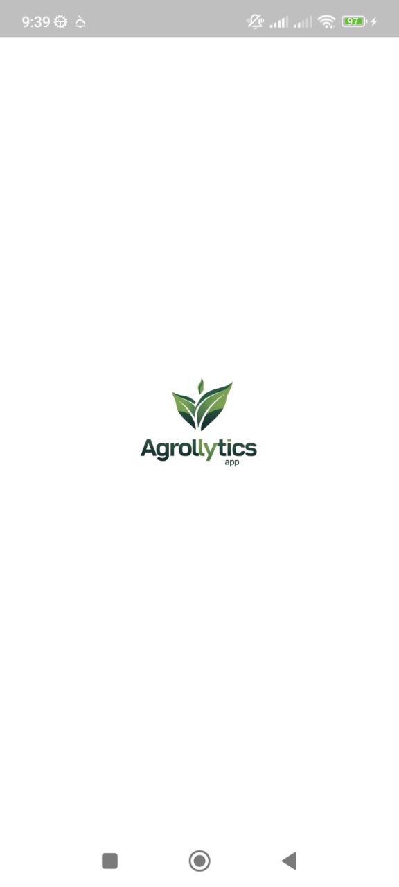
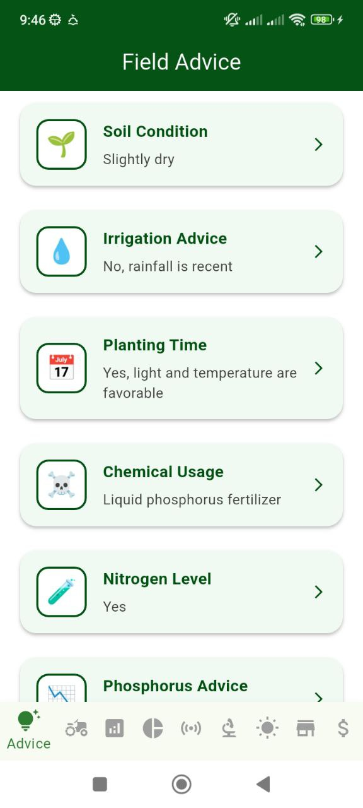
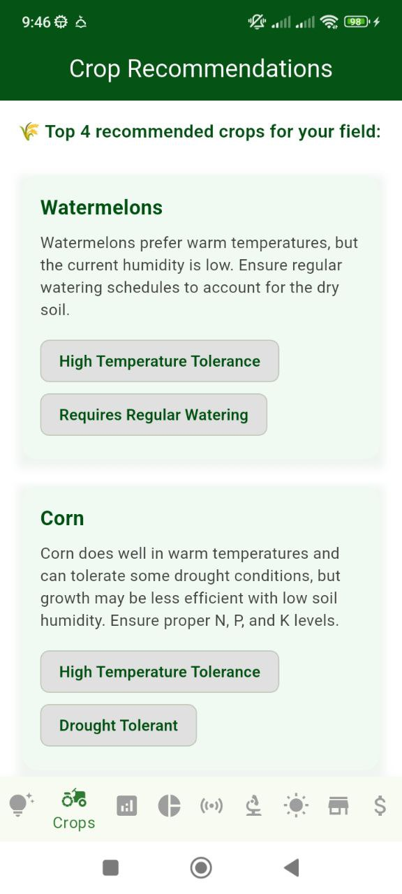
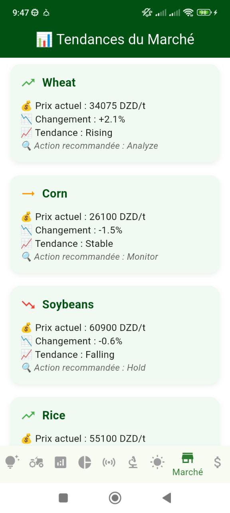
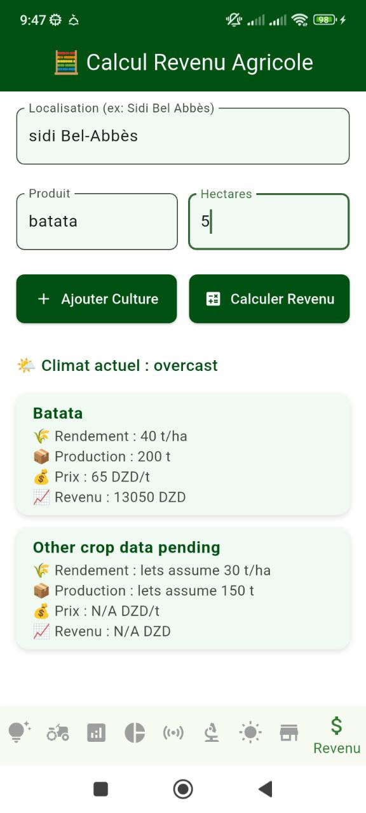
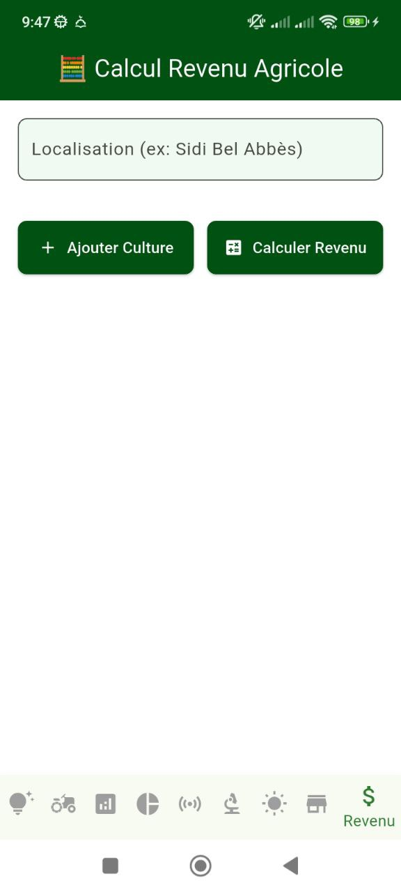
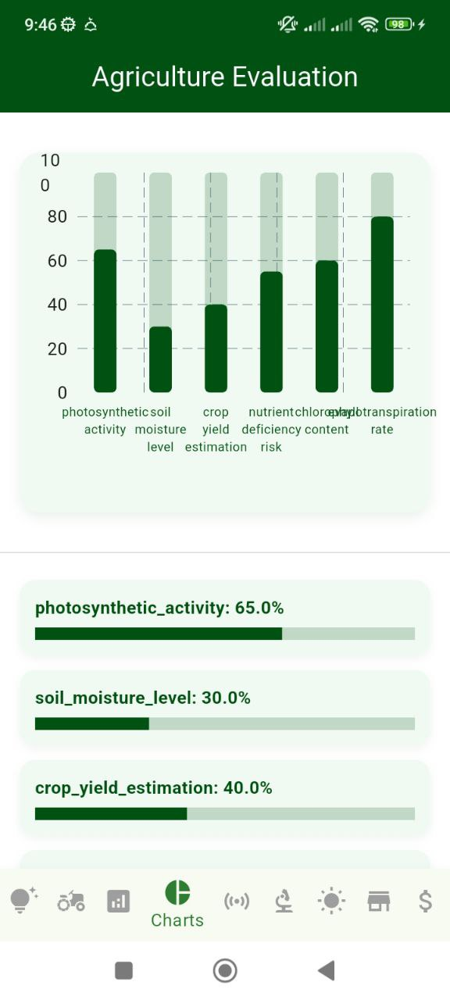
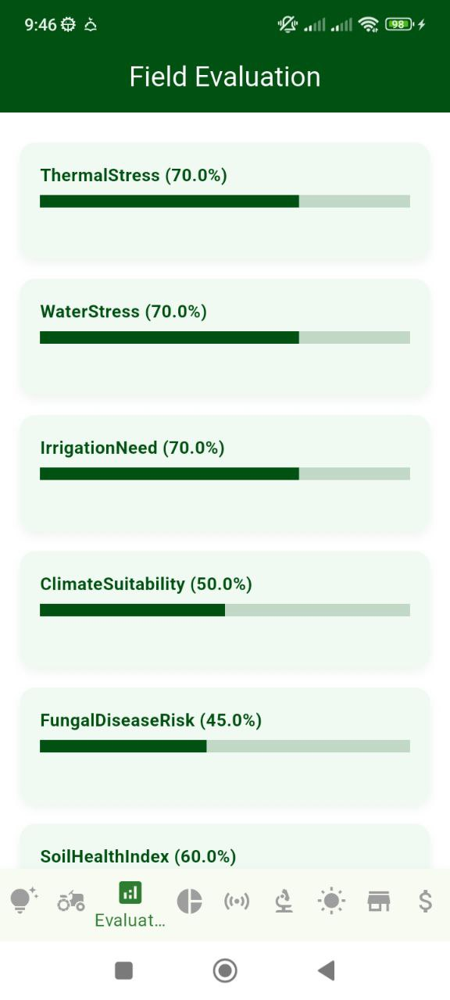
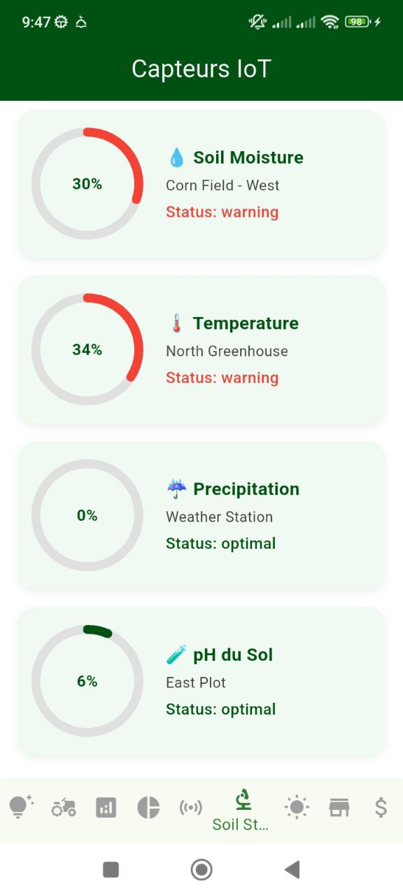
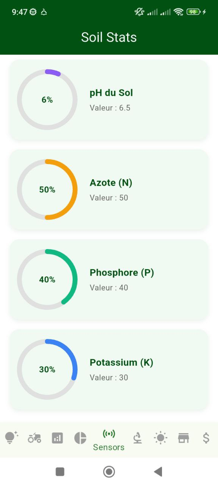

# Agrolytics – Application Mobile Agricole Basée sur l’IA, l’IoT et les Données Satellitaires

**Agrolytics** est une solution mobile intelligente conçue pour accompagner les agriculteurs dans toutes les étapes de leur production. Elle combine les technologies **IoT**, **images satellites**, et **intelligence artificielle** pour offrir des conseils agricoles personnalisés, des recommandations de cultures, et une analyse précise de la productivité et des tendances du marché.

## Fonctionnalités principales :

### Conseils agricoles basés sur l’IoT et les données satellites  
L’application intègre des données collectées via **capteurs IoT** (température, humidité, sol) et des **images satellites** pour fournir des conseils ciblés et adaptés aux conditions réelles du terrain.

### Recommandation intelligente des cultures (Crop Recommendation)  
En fonction des conditions climatiques, du type de sol et des prévisions saisonnières, Agrolytics recommande les cultures les mieux adaptées pour chaque région et chaque saison.

### Indicateurs agricoles dynamiques  
L’utilisateur peut suivre en temps réel des indicateurs clés tels que : taux d’humidité du sol, croissance des cultures, risque de maladie, stress hydrique, et autres paramètres critiques pour la production.

### Tendances du marché et estimation de la productivité  
Agrolytics fournit une analyse du marché agricole (prix, demande, stock) ainsi que des estimations de productivité basées sur les données collectées, permettant une planification optimale de la récolte et de la vente.

### Prévisions météorologiques agricoles avancées  
Grâce à un moteur de prévisions intégré, l’application anticipe les changements climatiques (pluie, sécheresse, température extrême) et aide les agriculteurs à ajuster leurs actions en fonction des prévisions locales.

## Objectif :  
Agrolytics vise à moderniser l’agriculture en fournissant une plateforme complète qui associe technologie, données et intelligence artificielle pour améliorer la productivité agricole, réduire les pertes, et renforcer la résilience face aux aléas climatiques et économiques.

---

## Aperçu de l'application

### Logo

### Tableau de bord

### Recommandation de cultures

### Analyse du marché

### Estimation de la productivité

### Indicateurs agricoles

### Valeurs IoT

